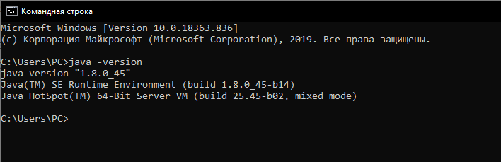
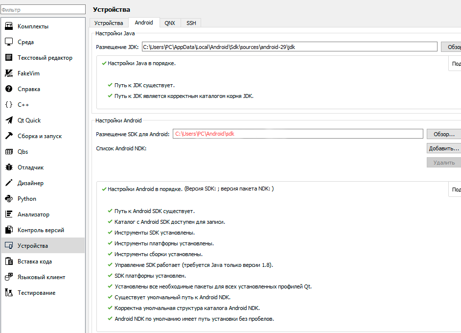
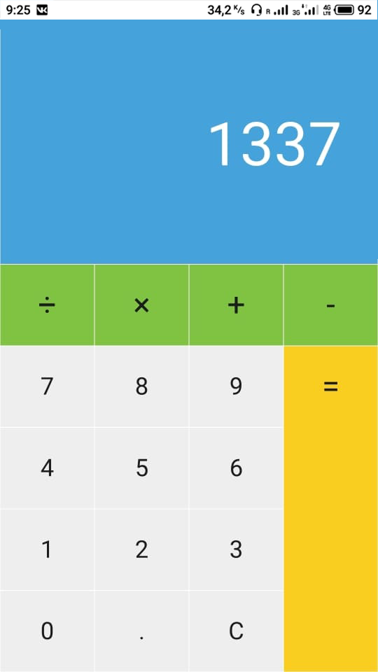

МИНИСТЕРСТВО НАУКИ  И ВЫСШЕГО ОБРАЗОВАНИЯ РОССИЙСКОЙ ФЕДЕРАЦИИ  

Федеральное государственное автономное образовательное учреждение высшего образования  

"КРЫМСКИЙ ФЕДЕРАЛЬНЫЙ УНИВЕРСИТЕТ им. В. И. ВЕРНАДСКОГО"  

ФИЗИКО-ТЕХНИЧЕСКИЙ ИНСТИТУТ  

Кафедра компьютерной инженерии и моделирования
  
### Отчёт по лабораторной работе № 8  по дисциплине "Программирование"
 
​Cтудента 1 курса группы ПИ-б-о-192(1) 
Гусько Елизавета Викторовна 
направления подготовки 09.03.04 "Программная инженерия"  
 

 
<table>

<tr><td>Научный руководитель  старший преподаватель кафедры  компьютерной инженерии и моделирования</td>

<td>(оценка)</td>

<td>Чабанов В.В.</td>

</tr>

</table>

  

​

Симферополь, 2020

 

# Лабораторная работа №8

# Настройка Qt Creator для разработки приложений под android

### ***Цель***: 
1. Настроить IDE Qt Creator для разработки приложений под android ОС;
2. Изучить базовые понятия связанные с мобильной разработкой;
3. Научиться создавать мобильные приложения при помощи фреймворка Qt 5.14.

 

1. Установка и проверка версии JDK:
Так как JDK уже установлен, то удостоверяемся в том, что версия верная:  

>рис 1. проверка версии jdk
2. Установка Android Studio
У меня уже установлена Android Studio со все6ми компонентами SDK.  

3. Подключение JDK, SDK, NDK 
Настраиваем QT

>рис 2. Подключение JDK, SDK, NDK
4. В примеах Qt выбираем произвольный проект и настраиваем его сборку для android.
Запускаем отладку. Нам предлагается выбрать один из запущенных эмуляторов или подключенных телефонов.   

>рис 3. запуск приложения через андроид

После разрешения на телефоне у нас открывается приложение.  

>рис 4. запущенное приложение на андроид

### Вывод: я научилась устанавливать компоненты, необходимые для android разработки, настроила Qt для работы с android и научилась создавать приложения для android при помощи Qt.

